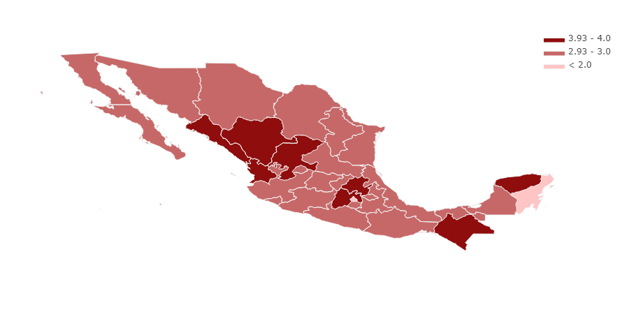

# Geographical distribution of electoral preferences in Mexico's 2012 presidential election

The present analysis uses presidential voting data from the [Instituto Nacional Electoral ](https://www.ine.mx/). It contains the votes obtained by each party or coalition during the 2012 presidential election
### Web site: https://alandavila.github.io/mexico-elections

## Observed trends:
* PRI had a stronghold in a few states including Sinaloa, Durango, Zacatecas, Mexico, Puebla, Chipas and Yucatan. The support of PRI was evenly distributed among the rest of the states except to Mexico City and Quintana Roo where it obtained half of the votes compared to their perfomance in the states listed above.
* PAN had the majority of its support coming from the northern states and the historically conservative states like Jalisco and Guanajuato.Veracruz, Campeche and Yucatan also represented a good portion of the votes for PAN.
* The PRD coallition showed a North- South divide with most of its supporters living in the south. Mexico City and Tabasco stand out. The candiate of the coalition was a former major of Mexico city and was born in Tabasco.

**PRI distribution of votes (normalized by each state's total number of voters)**

**PRD distribution of votes (normalized by each state's total number of voters)**

**PAN distribution of votes (normalized by each state's total number of voters)**

